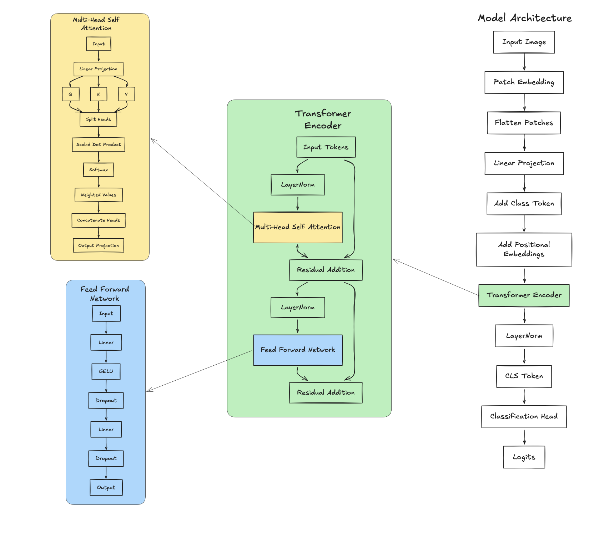

# Vision Transformer from Scratch

A complete implementation of the **Vision Transformer (ViT)** architecture from **"An Image is Worth 16×16 Words: Transformers for Image Recognition at Scale"**, implemented entirely from scratch in **PyTorch**.

---

## Features

- Patch Embedding
- Learnable Class Token
- Learnable Positional Embeddings
- Multi-Head Self Attention
- Feed Forward Network (MLP)
- Transformer Encoder Blocks
- Transformer Encoder Stack
- Complete Vision Transformer
- CIFAR-10 Training Pipeline
- AdamW Optimizer
- Linear Warmup + Cosine Learning Rate Scheduler
- Automatic Mixed Precision (CUDA)
- Gradient Clipping
- Model Checkpointing
- Resume Training
- Extensive Unit Tests

---

## Model Architecture



---

## Training Pipeline

The training pipeline includes

- CIFAR-10 data loading
- Data augmentation
- Data normalization
- AdamW optimizer
- Linear warmup
- Cosine learning-rate decay
- Automatic Mixed Precision (CUDA)
- Gradient clipping
- Checkpoint saving
- Resume training

---

## Running

Install dependencies

```bash
pip install -r requirements.txt
```

Run training

```bash
python main.py
```

---

## Testing

Run the complete test suite

```bash
pytest
```

or

```bash
pytest -v
```

---

## Paper

**An Image is Worth 16×16 Words: Transformers for Image Recognition at Scale**

- **Authors:** Alexey Dosovitskiy et al.
- **Conference:** ICLR 2021

--- 

## References

- Vision Transformer (ViT)
- PyTorch
- CIFAR-10
- AdamW Optimizer
